# MFD-CarPlay
[](https://github.com/JKBusse/MFD-CarPlay/actions/workflows/build-image.yaml)


# MFD-CarPlay

This project enables the integration of Apple CarPlay into the VW Radio Navigation System MFD (1999 model) using a Raspberry Pi HAT and custom software.

## Overview

The goal of this project is to bring modern smartphone integration (Apple CarPlay) into older car infotainment systems. By using a Raspberry Pi and the necessary components, users can bring modern technologies into their older vehicle's multimedia system.

## Features

- Integration of Apple CarPlay into the VW MFD Radio Navigation System.
- Uses a Raspberry Pi HAT for communication with the MFD system.

## The HAT


## Requirements

- Raspberry Pi (Model 4 or newer)
- Raspberry Pi MFD HAT
- VW Radio Navigation System MFD (1999 model)

## Installation

1. **Download the Raspberry Pi Imager:**
   - Download and Install the Raspberry Pi Imager on your Computer.
   ```
   https://www.raspberrypi.com/software/
   ```

2. **Add the MFD CarPlay Repository:**
   - Click on Settings:
   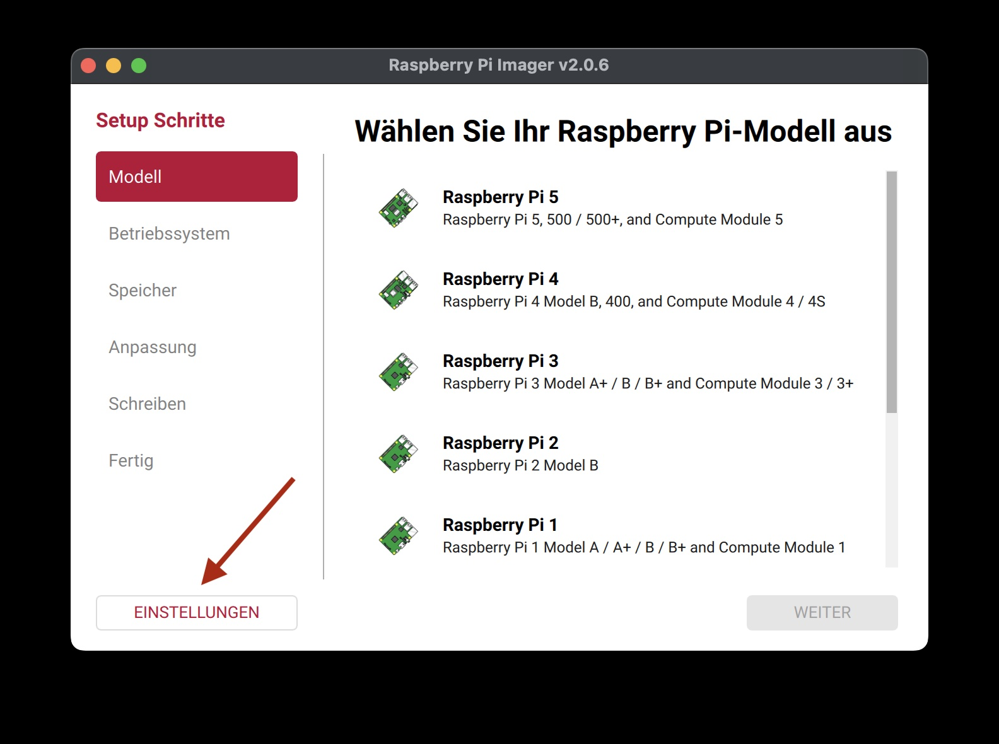

   - Add this URL:
   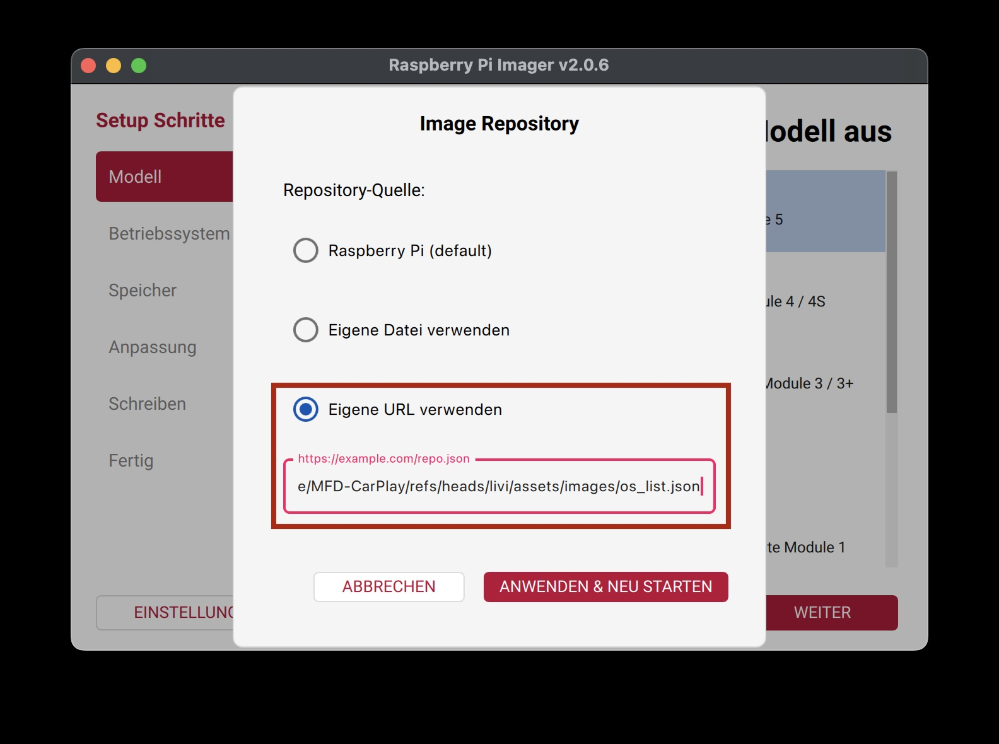

     ```
   https://github.com/JKBusse/MFD-CarPlay/raw/refs/heads/main/config/os_list.json
     ```
      And click save and restart

3. **Select your Raspberry Pi model:**
   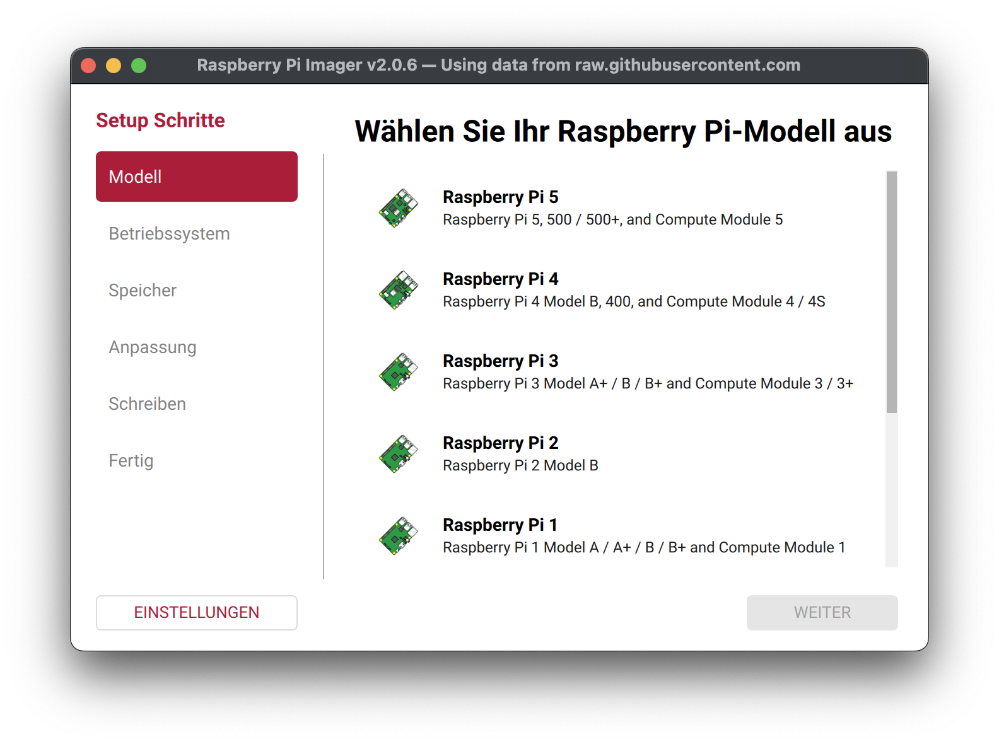

4. **Select the MFD CarPlay Image:**
   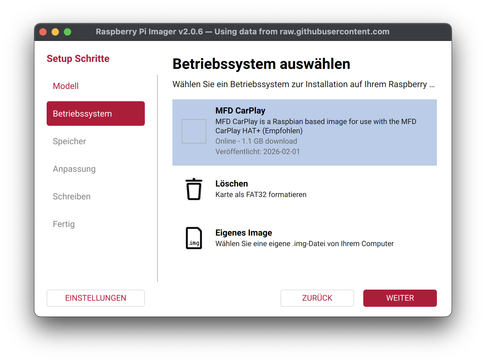

5. **Select your SD Card:**
   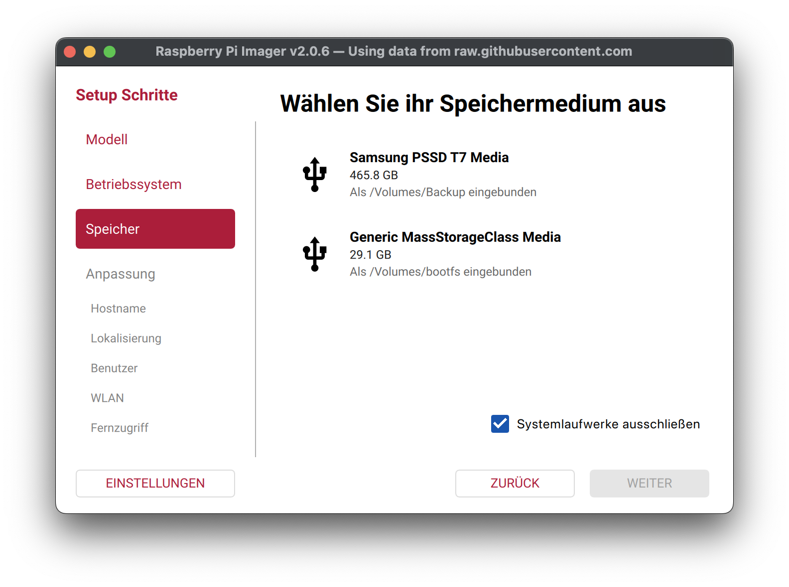

6. **Customize the image:**
   - Set the Hostname:
      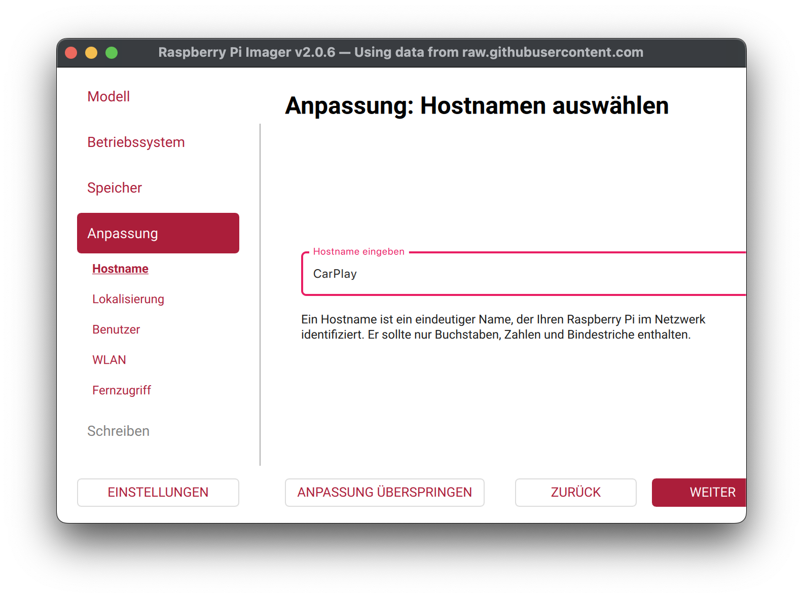
   
   - Select your location:
      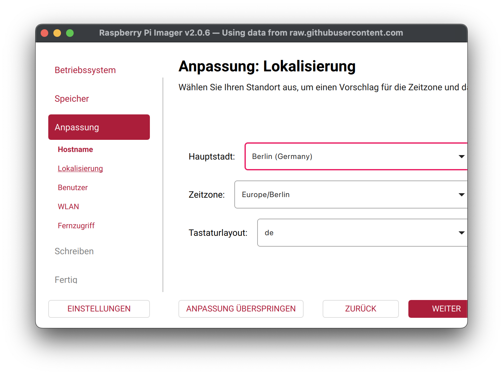

   - Set the User to pi (IMPORTANT!):
      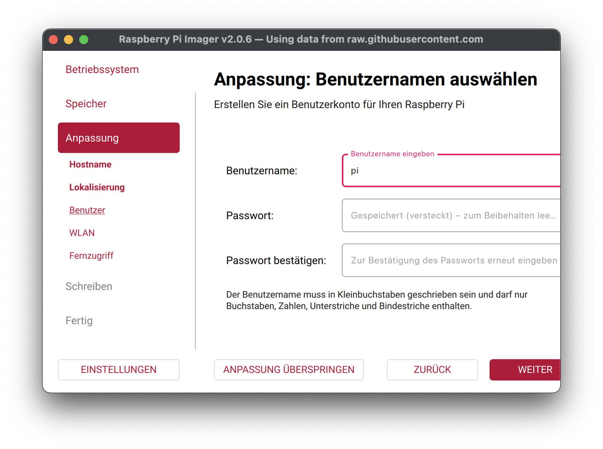

   - Set your WIFI Connection:
      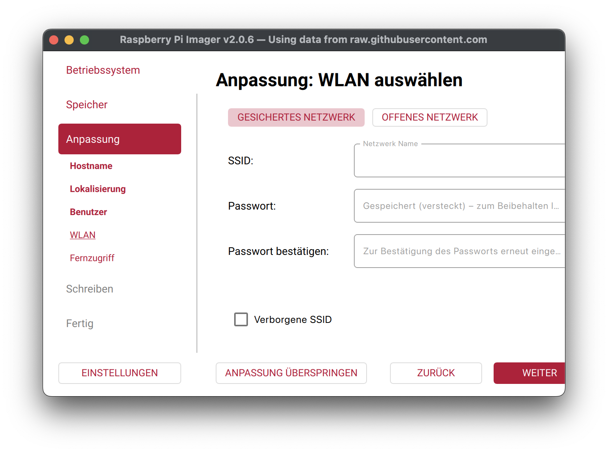

   - Setup SSH:
      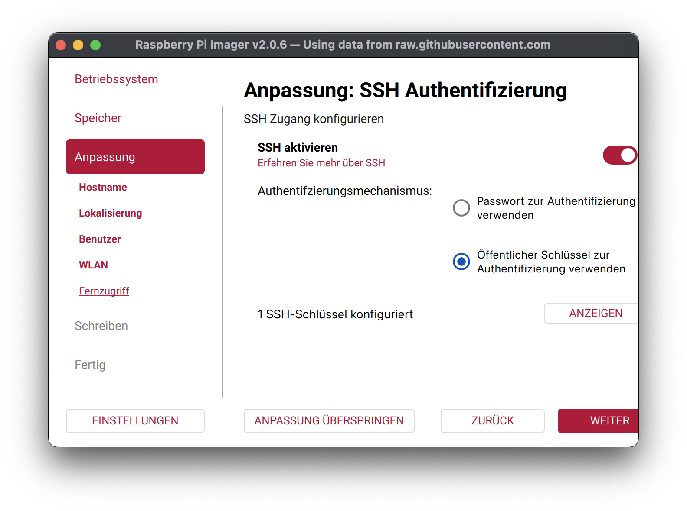

7. **Burn the Image:**
   - Now burn the image to your SD Card:
      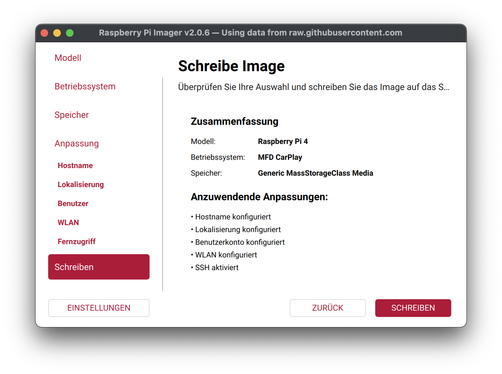
      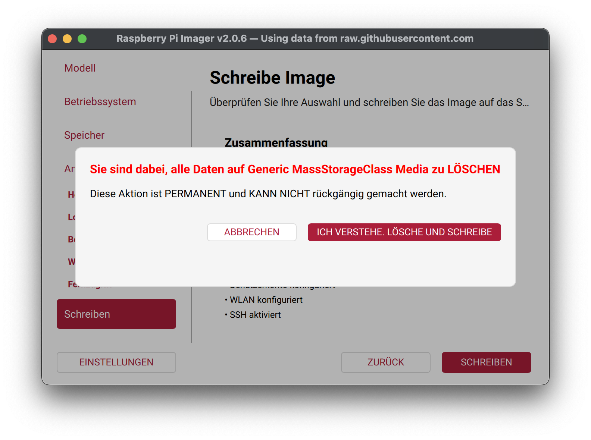

8. **Done**:
Now put the SD Card in your Raspberry Pi and connect the HAT to the MFD.

## Boot Behavior

- The first start performs cloud-init provisioning.
- Later boots use the optimized quiet-boot setup to reduce console output.
- The image uses a splash screen on boot when Plymouth is available in the target image.

## Troubleshooting

- Ensure the Raspberry Pi is correctly powered and properly connected to the MFD system.
- Double-check the configuration files for any missing or incorrect settings.

## Contributing

If you'd like to contribute to this project, feel free to fork the repository and submit pull requests. Any feedback or improvements are welcome!

## Support and Maintenance Policy

- **Issue reporting:** Please report bugs and feature requests via GitHub Issues in this repository.
- **Update cadence:**
   - Critical fixes (build breaks, boot failures, major regressions): as soon as possible.
   - Routine improvements and compatibility updates: batched and released regularly.
- **Release and metadata maintenance:** `config/os_list.json` is updated automatically by CI after successful image builds.
- **Officially tested models:** Raspberry Pi 4 and Raspberry Pi 5.
- **Best-effort scope:** Community support is best effort; hardware-specific edge cases may need logs and reproduction steps.
- **Boot troubleshooting:** If the first boot appears to pause after provisioning, wait for the automatic reboot once cloud-init finishes.

## License

This project repository is licensed under the MIT License.

- Full license text: [LICENSE](LICENSE)
- Credits: [CREDITS.md](CREDITS.md)
- Third-party notices: [THIRD_PARTY_NOTICES.md](THIRD_PARTY_NOTICES.md)

Note: The generated image contains third-party software (including LIVI and Debian/Raspberry Pi OS packages) with their own licenses.
